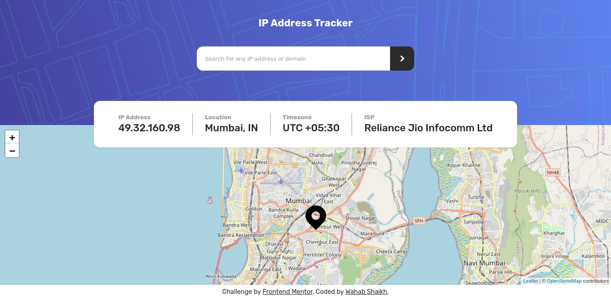

# Frontend Mentor - IP address tracker solution

This is a solution to the [IP address tracker challenge on Frontend Mentor](https://www.frontendmentor.io/challenges/ip-address-tracker-I8-0yYAH0). Frontend Mentor challenges help you improve your coding skills by building realistic projects.

## Table of contents

- [Overview](#overview)
  - [The challenge](#the-challenge)
  - [Screenshot](#screenshot)
  - [Links](#links)
- [My process](#my-process)
  - [Built with](#built-with)
- [Author](#author)

## Overview

### The challenge

Users should be able to:

- View the optimal layout for each page depending on their device's screen size
- See hover states for all interactive elements on the page
- See their own IP address on the map on the initial page load
- Search for any IP addresses or domains and see the key information and location

### Screenshot

### Links

- Solution URL: [https://www.frontendmentor.io/solutions/ip-address-tracker-with-react-tailwind-css-ipify-and-leaflet-1jcMJajrC](https://www.frontendmentor.io/solutions/ip-address-tracker-with-react-tailwind-css-ipify-and-leaflet-1jcMJajrC)
- Live Site URL: [https://ip-address-tracker-gamma-seven.vercel.app/](https://ip-address-tracker-gamma-seven.vercel.app/)

## My process

### Built with

- [React](https://reactjs.org/) - JS library
- [Tailwind CSS](https://tailwindcss.com/) - Utility-first CSS framework
- [Ipify](https://www.ipify.org/) - Public IP Address API
- [Leaflet](https://leafletjs.com/) - JavaScript library
  for mobile-friendly interactive maps
- [React Leaflet](https://react-leaflet.js.org/) - React components for Leaflet maps

## Author

- Website - [Wahab Shaikh](https://www.wahabshaikh.me)
- Frontend Mentor - [@wahabshaikh](https://www.frontendmentor.io/profile/wahabshaikh)
- Twitter - [@wahabshaikh\_](https://www.twitter.com/wahabshaikh_)
